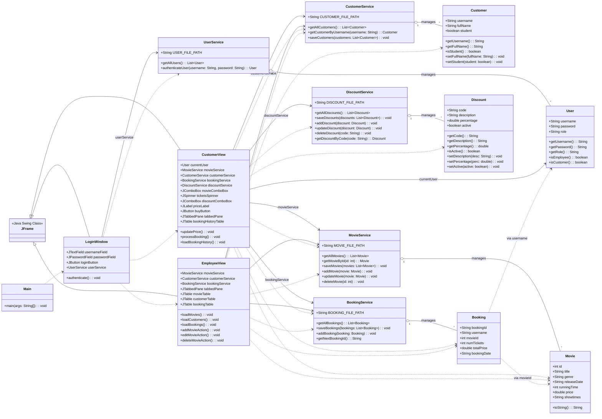

# Movie Ticket Booking System

## Description
This Java application allows customers to book movie tickets and employees to manage movies and reservations. It uses Java Swing for the graphical interface and MySQL database for data storage.

The application was developed as part of an object-oriented programming project in Java, with the goal of creating a complete movie ticket booking system that meets the needs of both customers and cinema management.

## Features

### For Customers
- Login with username and password
- Browse available movies with their details (title, genre, release date, runtime, price)
- View movie posters and synopses
- View showtimes for each movie
- Book tickets with selection of number of seats
- Choose specific session dates and times
- Apply different discounts (student, welcome offers)
- Secure payment processing with card details
- View booking history

### For Employees
- View all bookings made
- Complete movie management (add, edit, delete)
- Manage movie posters and synopses
- View customer information
- Manage screens and showtimes
- Process payments
- View detailed sales statistics
- Access payment records

## Installation
1. Clone this repository
2. Open the project in IntelliJ IDEA or your preferred Java IDE
3. Make sure JDK 23 is installed
4. Set up a MySQL database named 'cinema' (import the SQL dump from `src/cinemadb.txt`)
5. Configure the database connection settings in `src/config.properties`
6. Run the `Main.java` class

## Usage

### Login Interface
The application opens with a login window where the user must enter their username and password. Depending on the user's role (customer or employee), the corresponding interface will be displayed.

### Customer Interface
The customer interface is organized into two tabs:
- **Book Tickets**: Allows booking tickets by selecting a movie, number of tickets, and an applicable discount
- **Booking History**: Displays the customer's booking history

### Employee Interface
The employee interface is organized into three tabs:
- **Manage Movies**: Allows adding, editing, or deleting movies
- **View Customers**: Displays the list of customers with their information
- **View Bookings**: Displays all bookings made

## Project Structure

### Class Diagram

### Package Organization
- `model/`: contains model classes (User, Customer, Movie, Booking, Discount)
- `service/`: contains service classes for data management (UserService, CustomerService, MovieService, BookingService, DiscountService)
- `gui/`: contains user interface classes (LoginWindow, CustomerView, EmployeeView)

## Database Structure
The application uses a MySQL database with the following tables:
- `users`: contains user authentication information (username, password, role)
- `customer`: contains customer information (username, fullName, student)
- `movie`: contains movie information (id, title, genre, releaseDate, runningTime, price, showtimes, poster, synopsis)
- `booking`: contains booking information (bookingId, username, movieId, numTickets, totalPrice, bookingDate, sessionDate, sessionTime)
- `discount`: contains information about available discounts (code, description, percentage, active)
- `payment`: tracks payment information (paymentId, bookingId, paymentDate, amount, paymentMethod, card details)
- `screen`: manages cinema screens (screenId, movieId, capacity)

## Discount System
The application implements a flexible discount system:
- Student discount (10%): verification of student status in the customer profile
- Welcome discount (5%): for new customers (code: BIENVENUE5)
- Additional discounts can be added through the database

## Test Accounts

### Customers
- Username: emma.lune, Password: azerty123
- Username: louis.dupont, Password: monpass45

### Employees
- Username: claire.baudoin, Password: admin789
- Username: marc.lemans, Password: gestion2024

## Technologies Used
- Java 23
- Java Swing for the graphical interface
- MySQL database for data persistence
- JDBC for database connectivity

## Architecture
The application follows a three-tier architecture:
1. **Presentation Layer**: GUI classes (LoginWindow, CustomerView, EmployeeView)
2. **Business Layer**: Services (UserService, CustomerService, MovieService, BookingService, DiscountService, PaymentService, ScreenService)
3. **Data Layer**: Models (User, Customer, Movie, Booking, Discount, Payment, Screen) and MySQL database

This architecture allows for a clear separation of concerns and facilitates code maintenance.

## Security Features
- Password hashing for user authentication
- Card details protection in payment processing
- Input validation to prevent SQL injection
- Session management for authenticated users
